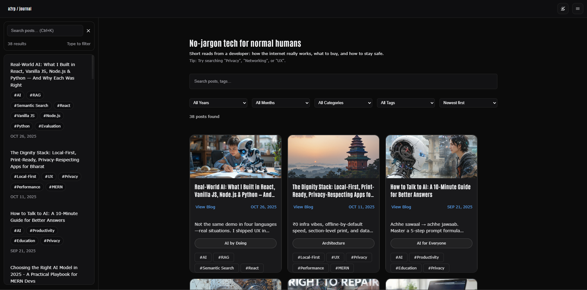

# a2rp Journal

A focused React and Vite blog for clear, practical technology essays about the internet, software, privacy, and everyday digital life.



## Features

- Fixed desktop navigation with searchable post list
- Responsive mobile menu
- Search, filters, tags, and date sorting
- Lazy-loaded article pages with previous and next navigation
- Dark and light themes with saved preference
- GitHub Pages deployment

## Run locally

```bash
npm install
npm run dev
```

Build with `npm run build` and deploy with `npm run deploy`.

## Links

- Live: https://a2rp.github.io/blog/
- Repository: https://github.com/a2rp/blog
- Portfolio: https://www.ashishranjan.net/
- GitHub: https://github.com/a2rp
- CodePen: https://codepen.io/ash1198
- LinkedIn: https://www.linkedin.com/in/aashishranjan
- Facebook: https://www.facebook.com/theash.ashish/
- YouTube: https://www.youtube.com/@ashishranjan-ashz?sub_confirmation=1
- Email: mailto:ash.ranjan09@gmail.com

## Support

- Support: https://a2rp-donation-page.netlify.app/
- Buy Me a Coffee: https://buymeacoffee.com/a2rp
- Patreon: https://www.patreon.com/a2rp
